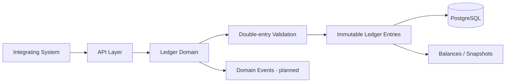

# EveryLedger
test
EveryLedger is planned as a generic embeddable and integratable double-entry ledger service for tracking arbitrary user-defined assets or units, such as fiat currencies, loyalty points, game currencies, compute credits, inventory units, tokens, or domain-specific units.

This repository contains a Java 21 Spring Boot foundation, an immutable domain model, and plain Java application services for registering assets, creating accounts, posting transactions, reading account entries, and deriving balances. Persistence adapters and HTTP APIs are not implemented yet.

## Goals

- Model a correct, auditable double-entry ledger for arbitrary asset types.
- Emphasize correctness, traceability, and explicit transaction semantics over feature count.
- Demonstrate Java and Spring architecture with domain-oriented packaging.
- Provide integration-friendly APIs for other systems once core ledger rules are implemented.

## Planned Features

- Asset types.
- Accounts.
- Immutable ledger entries.
- Transactions.
- Double-entry validation.
- Derived balances.
- Transaction metadata.
- Idempotency keys.
- External references.
- Auditability.
- Reconciliation.
- Snapshots and projections.
- Exchanges between asset types.
- Explicit recording of both sides of an exchange.
- Domain events.
- API integration into other systems.

## Architecture

The intended architecture centers on a domain model that validates transactions before immutable ledger entries are recorded. API and persistence code should depend on the domain model rather than bypassing it. Projections and snapshots can optimize reads without becoming the source of truth.

## Repository Structure

- `src/main/java/com/everyledger/account` - account model; `application` contains creation, history, balance, and the account port.
- `src/main/java/com/everyledger/asset` - asset-type model; `application` contains registration and the asset port.
- `src/main/java/com/everyledger/ledger` - immutable entries and entry directions.
- `src/main/java/com/everyledger/transaction` - transaction invariants; `application` contains posting and the transaction port.
- `src/main/java/com/everyledger/exchange` - planned cross-asset exchange recording.
- `src/main/java/com/everyledger/reconciliation` - planned reconciliation workflows.
- `src/main/java/com/everyledger/event` - planned domain event publishing boundaries.
- `src/main/java/com/everyledger/api` - planned HTTP API layer.
- `src/main/java/com/everyledger/config` - planned application configuration.
- `src/main/resources/db/migration` - future Flyway or Liquibase migrations.
- `docs` - architecture and ledger model notes.

## Technology Stack

- Java - primary language.
- Maven - build tool.
- Spring Boot - planned application framework.
- Spring Web - planned HTTP API.
- Spring Data - planned persistence integration.
- Spring Security - planned where appropriate.
- PostgreSQL - planned persistence layer.
- Flyway or Liquibase - planned database migrations.
- Testcontainers - planned integration testing.
- OpenAPI - planned API documentation.
- Kafka - planned later only if domain events justify it.

Application services use constructor-injected repository ports. In-memory implementations exist only in tests. See [Architecture](docs/architecture.md) and [Ledger Model](docs/ledger-model.md) for current contracts and semantics.

## Development

Set `JAVA_HOME` to a Java 21 JDK and run `mvn test`. Run the minimal Boot application with `mvn spring-boot:run`; application services are not yet wired into Spring.

## Roadmap

- [x] Define asset, account, transaction, and ledger entry domain model.
- [x] Establish double-entry validation rules.
- [x] Add application use cases and persistence ports.
- [ ] Add persistence migrations for immutable entries.
- [ ] Add idempotency-key handling.
- [ ] Add balance projections and snapshot strategy.
- [ ] Add reconciliation workflows.
- [ ] Add HTTP API and OpenAPI documentation.
- [ ] Add integration tests with PostgreSQL.

## License

MIT. See `LICENSE`.

EveryLedger is under active development.
